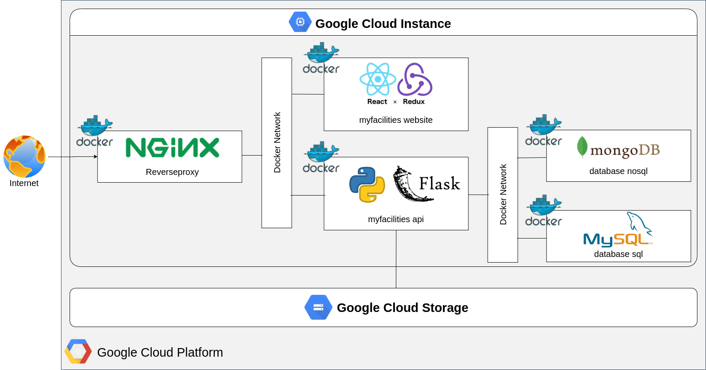

# My Facilities
The Facilities Management Software Project

## Architecture
This project is using several technologies in frontend and backend.
- Frontend using ReactJS and Redux frameworks.
- And, backend using Nginx as a reverse proxy, Python and Flask as API, and the database using MongoDB and Mysql.

For illustration is shown below.

